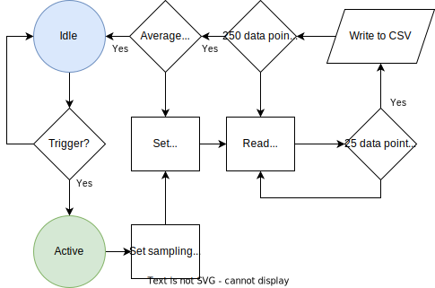

# E-Motion-chair

## Getting started

Add the [ESP board URL] to your arduino IDE.  
Update the board manager by typing esp32 and download/update the boards available.

The [LilyGO TTGO T8 ESP32-S2] - with SD Card Slot is used in this project.  

To use the SD card you need to change the pin definition to comunicate over SPI.  
You will find the h-file you need to change in the installed package of esp32s2.  
If you are on windows you will find the package in AppData.

`...\AppData\Local\Arduino15\packages\esp32\hardware\esp32\2.0.4\variants\esp32s2\pins_arduino.h`  

Open the file and change the SS, MOSI, MISO and SCK to match the following:

```js
static const uint8_t SS    = 10;
static const uint8_t MOSI  = 11;
static const uint8_t MISO  = 13;
static const uint8_t SCK   = 12;
```

You need to download and install 2 modules as .zip for this project:
* [ESPAsyncWebServer] 
* [AsyncTCP]

[ESP board URL]: https://raw.githubusercontent.com/espressif/arduino-esp32/gh-pages/package_esp32_dev_index.json
[ESPAsyncWebServer]: https://github.com/me-no-dev/ESPAsyncWebServer/archive/master.zip
[AsyncTCP]: https://github.com/me-no-dev/AsyncTCP/archive/master.zip
[LilyGO TTGO T8 ESP32-S2]: https://www.tinytronics.nl/shop/en/development-boards/microcontroller-boards/with-wi-fi/lilygo-ttgo-t8-esp32-s2-with-sd-card-slot

Do not forget to format your sd card to FAT32.  
Add the index.html file to your sd card and upload the project!

Relevant info:
* https://randomnerdtutorials.com/esp32-async-web-server-espasyncwebserver-library/
* https://www.easeus.com/partition-master/sd-card-mounted-as-read-only.html

## TODO

*Implement sensing logic to only safe data when someone is sitting
*change the select_sensor_to_read() and read_sensor() with real sensor data.

<p align="center">

</p> 

## Tests

*Current writing speed is +-38files/minute thus an estimate of 20ms to safe data to file

<div align="center">

|  Time  | Files | 
|--------|-------|
| 0 min. |  169  |
| 1 min. |  207  |
| 2 min. |  245  |
| 3 min. |  282  |
| 4 min. |  319  |
| 5 min. |  356  |

</div>

